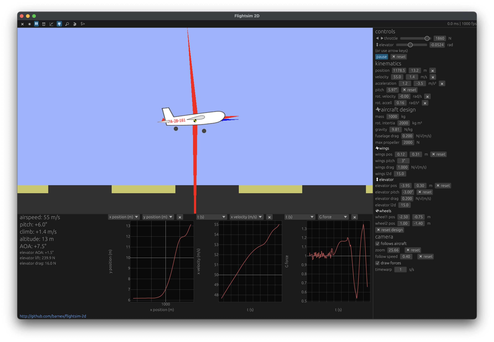
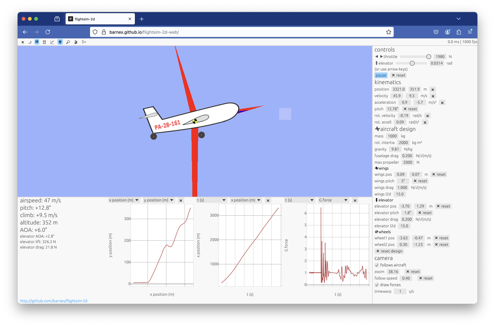

# flightsim2d

2D airplane simulator with simplified but realistic physics.

[](https://vimeo.com/980784734)

Video: [vimeo.com/980784734](https://vimeo.com/980784734)


Run in your browser: [barnex.github.io/flightsim-2d-web](https://barnex.github.io/flightsim-2d-web/) (Requires [WGPU support](https://caniuse.com/webgpu))


[](https://barnex.github.io/flightsim-2d-web/)

## Build from source

[Install Rust](https://rustup.rs).

```
git clone https://github.com/barnex/flightsim-2d.git
cd flightsim-2d
cargo run --release
```